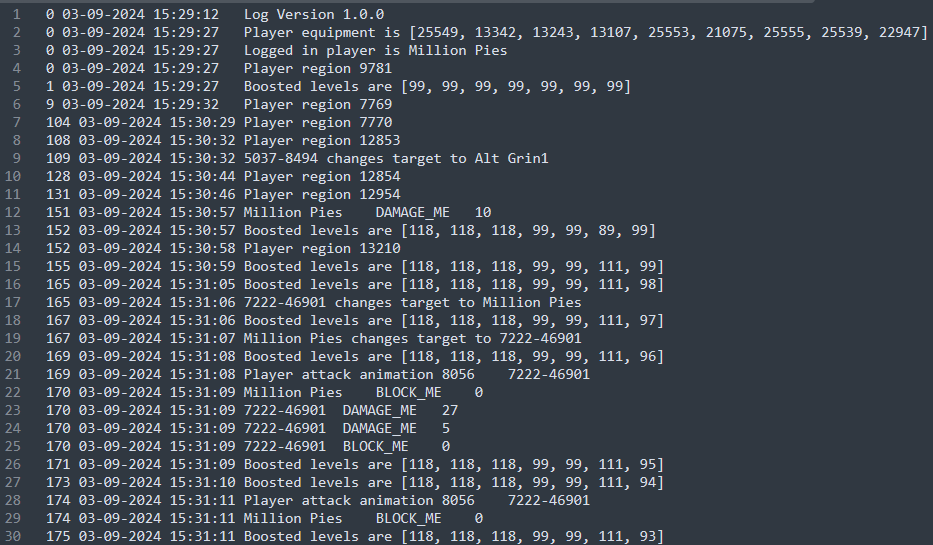

# Combat Logger
Logs combat events to a text file. Upload and analyze your logs at [runelogs.com](https://runelogs.com/).  
Logs are stored in `.runelite\combat_log`

## Reading the logs

1. **Timestamps:**
    - Timestamps follow this format: `MM-DD-YYYY HH:MM:SS.mmm TimeZone`  
      Example: `02-23-2024 23:06:10.999 CST`

2. **Hitsplats:**
    - Hitsplats are applied in this format: `TARGET	HITSPLAT_NAME AMOUNT`  
    - Note: The source of the hitsplat is not available, however hitsplat names that include ME (e.g. DAMAGE_MAX_ME) were either dealt by you or to you.  
      Example: `The Leviathan DAMAGE_MAX_ME 69` - I did a max hit of 69 to The Leviathan  
      Example: `Cow31337Killer DAMAGE_ME 25` - The logged in player (Cow31337Killer) took 25 damage  
      Example: `Scurrius DAMAGE_OTHER 10` - Someone else did 10 damage to Scurrius
3. **Equipment:**
    - Equipped items use the item id and can be checked using the [Wiki Minimal OSRS Item DB](https://chisel.weirdgloop.org/moid/item_id.html). You can paste the whole item id list in at once.  
      Example: `Player equipment is [19649, 21780, 12002, 27275, 21021, 21024, 19544, 13235, 28313]`

4. **Boosted Levels:**
    - Boosted levels are reported in this order: attack, strength, defence, ranged, magic, hitpoints, prayer.  
      Example: `Boosted levels are [99, 99, 99, 99, 99, 99, 99]`

## Chat Command

- `::newlog` - Creates a new log file